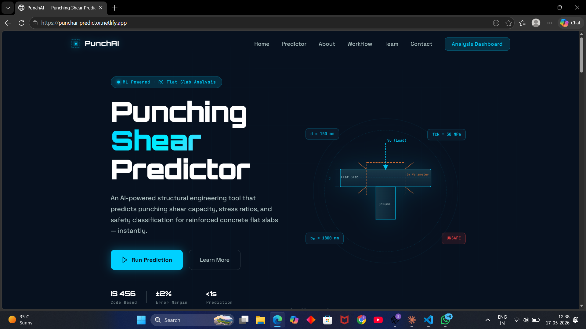
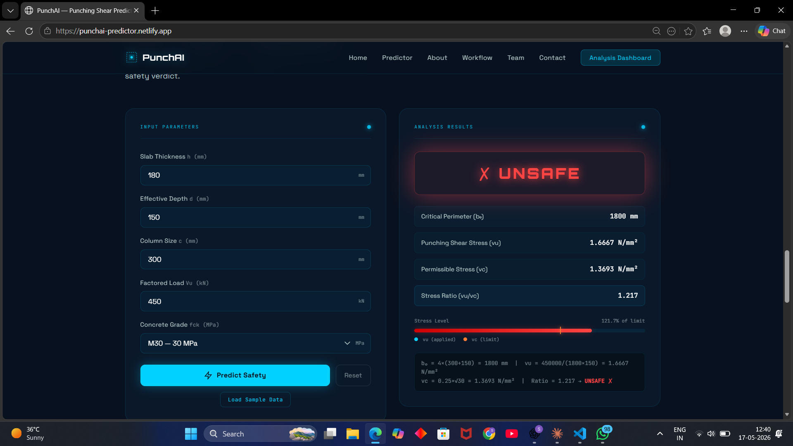
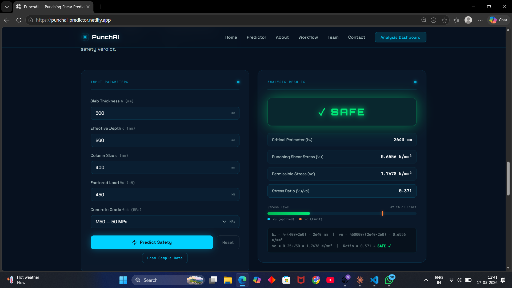

# PunchAI — Punching Shear Capacity Predictor for RC Flat Slabs

[](https://punchai-predictor.netlify.app/)
[](https://github.com/shridhartapakire/punching-shear-predictor)
[]()
[]()

---

## 📌 Overview

**PunchAI** is a web-based structural engineering calculator that predicts the **punching shear capacity of reinforced concrete flat slabs** based on IS 456:2000 provisions.

Given five input parameters — slab thickness, effective depth, column size, factored load, and concrete grade — the tool computes the critical perimeter, applied shear stress, permissible stress, and outputs a **SAFE / UNSAFE** classification with a visual stress ratio bar and full formula breakdown.

All calculations are performed client-side in the browser with no backend required.

> **Note:** The term "AI" in the project name refers to the automated analysis workflow, not a trained machine learning model. All predictions use deterministic analytical formulas as specified in IS 456:2000 Clause 31.6.

---

## 🌐 Live Demo

🔗 **[https://punchai-predictor.netlify.app](https://punchai-predictor.netlify.app/)**

---

## 📸 Screenshots

### 🔵 Intro Animation


> Fullscreen loading screen with animated particle grid, scan line, and progress bar — auto-dismisses after 3 seconds into the homepage.

---

### 🏠 Hero Section


> Landing page with the structural slab diagram, floating data chips (d = 150 mm, fck = 30 MPa, b₀ = 1800 mm, UNSAFE), CTA buttons, and IS 456 / ±2% / <1s stat bar.

---

### 📊 Prediction Dashboard — Input Form


> Input card with five parameters: Slab Thickness (h), Effective Depth (d), Column Size (c), Factored Load (Vu), and Concrete Grade (fck). Includes **Load Sample Data** and **Reset** controls.

---

### ❌ Result — UNSAFE


> **Input:** h = 180 mm · d = 150 mm · c = 300 mm · Vu = 450 kN · M30
> **Output:** b₀ = 1800 mm · vu = 1.6667 N/mm² · vc = 1.3693 N/mm² · Ratio = 1.217 → **UNSAFE**
> Red glowing verdict badge, stress bar at 121.7% of limit, and full formula trace displayed below.

---

### ✅ Result — SAFE


> **Input:** h = 300 mm · d = 260 mm · c = 400 mm · Vu = 450 kN · M50
> **Output:** b₀ = 2640 mm · vu = 0.6556 N/mm² · vc = 1.7678 N/mm² · Ratio = 0.371 → **SAFE**
> Green glowing verdict badge, stress bar at 37.1% of limit, and full formula trace displayed below.

---

## ✨ Features

- **Instant Calculation** — results in under 1 second, entirely in the browser
- **IS 456:2000 Compliant** — follows Indian Standard code provisions (Cl. 31.6.3)
- **SAFE / UNSAFE Verdict** — colour-coded output with animated glow (green / red)
- **Stress Ratio Bar** — visual comparison of applied vs permissible shear stress with percentage
- **Full Formula Trace** — every calculation step shown below the result for verification
- **Sample Data Loader** — one-click load of a verified test case for quick demonstration
- **Responsive Design** — works on desktop, tablet, and mobile
- **No Runtime Dependencies** — pure HTML, CSS, and JavaScript; no frameworks, no build step
- **Input Validation** — catches invalid entries (e.g. d ≥ h) with descriptive error messages
- **Intro Animation** — fullscreen loading screen with particle canvas and scan line effect

---

## 🧮 Engineering Formulas

All calculations follow **IS 456:2000, Clause 31.6 — Flat Slabs**.

### 1. Critical Perimeter

```
b₀ = 4 × (c + d)
```

The failure perimeter is assumed at `d/2` from each face of the column on all four sides.

| Symbol | Description | Unit |
|--------|-------------|------|
| `b₀` | Critical shear perimeter | mm |
| `c` | Column size (square column assumed) | mm |
| `d` | Effective depth of slab | mm |

---

### 2. Punching Shear Stress

```
vu = Vu / (b₀ × d)
```

`Vu` is converted from kN to N before substitution.

| Symbol | Description | Unit |
|--------|-------------|------|
| `vu` | Applied punching shear stress | N/mm² |
| `Vu` | Factored concentrated load | kN → N |
| `b₀` | Critical perimeter | mm |
| `d` | Effective depth | mm |

---

### 3. Permissible Shear Stress

```
vc = 0.25 × √fck
```

| Symbol | Description | Unit |
|--------|-------------|------|
| `vc` | Permissible punching shear stress | N/mm² |
| `fck` | Characteristic compressive strength | MPa |

---

### 4. Safety Classification

```
if vu > vc  →  UNSAFE
if vu ≤ vc  →  SAFE
```

---

## 🧪 Sample Test Data

Both cases below match the tool output exactly and are visible in the screenshots above.

### Case 1 — UNSAFE ❌

| Parameter | Value |
|-----------|-------|
| Slab thickness `h` | 180 mm |
| Effective depth `d` | 150 mm |
| Column size `c` | 300 mm |
| Factored load `Vu` | 450 kN |
| Concrete grade | M30 — 30 MPa |

| Result | Value |
|--------|-------|
| Critical Perimeter `b₀` | 1800 mm |
| Punching Shear Stress `vu` | 1.6667 N/mm² |
| Permissible Stress `vc` | 1.3693 N/mm² |
| Stress Ratio `vu / vc` | 1.217 |
| **Verdict** | ❌ **UNSAFE** |

---

### Case 2 — SAFE ✅

| Parameter | Value |
|-----------|-------|
| Slab thickness `h` | 300 mm |
| Effective depth `d` | 260 mm |
| Column size `c` | 400 mm |
| Factored load `Vu` | 450 kN |
| Concrete grade | M50 — 50 MPa |

| Result | Value |
|--------|-------|
| Critical Perimeter `b₀` | 2640 mm |
| Punching Shear Stress `vu` | 0.6556 N/mm² |
| Permissible Stress `vc` | 1.7678 N/mm² |
| Stress Ratio `vu / vc` | 0.371 |
| **Verdict** | ✅ **SAFE** |

---

## 📁 Folder Structure

```
punching-shear-predictor/
│
├── index.html              # Complete single-page website (all sections)
├── style.css               # Stylesheet — dark theme, animations, responsive layout
├── script.js               # Calculation engine, form logic, scroll animations
├── README.md               # Project documentation
│
└── screenshots/
    ├── intro.png           # Intro animation loading screen
    ├── hero.png            # Hero section with slab diagram
    ├── dashboard.png       # Empty prediction dashboard
    ├── result-unsafe.png   # UNSAFE result — h=180, d=150, c=300, Vu=450, M30
    └── result-safe.png     # SAFE result — h=300, d=260, c=400, Vu=450, M50
```

No build tools, package managers, or external dependencies required. Download the three source files and open `index.html` directly in any browser.

---

## 🛠️ Technologies Used

| Technology | Purpose |
|------------|---------|
| HTML5 | Page structure and semantic markup |
| CSS3 | Styling, glassmorphism cards, animations, responsive grid |
| Vanilla JavaScript | Calculation engine, DOM manipulation, scroll animations |
| Canvas API | Intro animation — particle network and scan line effect |
| Google Fonts | Orbitron, Space Grotesk, JetBrains Mono |
| Netlify | Static site hosting and deployment |

No frameworks. No build tools. No backend. The entire project runs from three files.

---

## 🚀 Getting Started

### Option 1 — Open Directly

```bash
# Clone the repository
git clone https://github.com/shridhartapakire/punching-shear-predictor.git

# Navigate into the folder
cd punching-shear-predictor

# Open in browser — Windows
start index.html

# Open in browser — macOS
open index.html

# Open in browser — Linux
xdg-open index.html
```

### Option 2 — Live Server in VS Code

1. Open the folder in **VS Code**
2. Install the **Live Server** extension by Ritwick Dey
3. Right-click `index.html` → **Open with Live Server**

---

## ☁️ Deployment

Deployed on **Netlify** via drag-and-drop.

**Redeploy your own copy:**

1. Go to [netlify.com](https://netlify.com) and sign in
2. Click **Add new site → Deploy manually**
3. Drag the project folder into the upload area
4. Live at a `*.netlify.app` URL instantly

**Auto-deploy from GitHub:**

1. **Add new site → Import an existing project**
2. Connect GitHub and select this repository
3. Leave build settings blank (static site)
4. Click **Deploy** — every push to `main` redeploys automatically

---

## 🔭 Future Scope

- [ ] Support for **rectangular columns** (non-square critical perimeters)
- [ ] Include effect of **shear reinforcement** (headed studs, bent-up bars)
- [ ] Add **ACI 318** and **Eurocode 2** code options for international comparison
- [ ] Export results as a **PDF report** for design documentation
- [ ] **Comparison table** for multiple cases in one session
- [ ] **Unit conversion toggle** — metric and imperial support
- [ ] Offline support via **Progressive Web App (PWA)**

---

## 📐 Project Details

| Detail | Value |
|--------|-------|
| Code Reference | IS 456:2000, Clause 31.6.3 |
| Live URL | [punchai-predictor.netlify.app](https://punchai-predictor.netlify.app/) |
| Repository | [github.com/shridhartapakire/punching-shear-predictor](https://github.com/shridhartapakire/punching-shear-predictor) |

---

## 📄 License

Released for **academic and educational use**. All engineering formulas are sourced from IS 456:2000, published by the Bureau of Indian Standards.

---

*Built with care for the Civil Engineering community.*